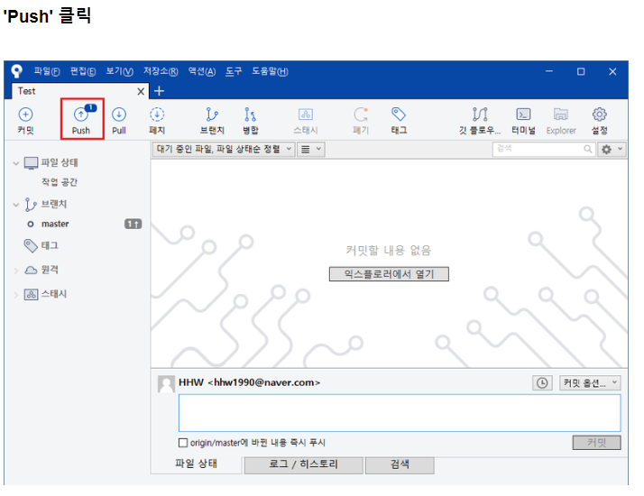

# GIT 중급

## 

#### Git 브랜치의 이해

**커밋하면 Git은 현 Staging Area에 있는 데이터의 스냅샷에 대한 포인터, 저자나 커밋 메시지 같은 메타데이터, 이전 커밋에 대한 포인터 등을 포함하는 커밋 개체(커밋 Object)를 저장한다. 이전 커밋 포인터가 있어서 현재 커밋이 무엇을 기준으로 바뀌었는지를 알 수 있다. 최초 커밋을 제외한 나머지 커밋은 이전 커밋 포인터가 적어도 하나씩 있고 브랜치를 합친 Merge 커밋 같은 경우에는 이전 커밋 포인터가 여러 개 있다.**

**`git commit` 으로 커밋하면 먼저 루트 디렉토리와 각 하위 디렉토리의 트리 개체를 체크섬과 함께 저장소에 저장한다. 그다음에 커밋 개체를 만들고 메타데이터와 루트 디렉토리 트리 개체를 가리키는 포인터 정보를 커밋 개체에 넣어 저장한다. 그래서 필요하면 언제든지 스냅샷을 다시 만들 수 있다.**

**이 작업을 마치고 나면 Git 저장소에는 다섯 개의 데이터 개체가 생긴다. 각 파일에 대한 Blob 세 개, 파일과 디렉토리 구조가 들어 있는 트리 개체 하나, 메타데이터와 루트 트리를 가리키는 포인터가 담긴 커밋 개체 하나이다.**

#### source tree 설치,파일 삭제  관련 주소

https://m.blog.naver.com/PostView.nhn?blogId=hhw1990&logNo=221243608553&proxyReferer=https%3A%2F%2Fwww.google.co.kr%2F

#### source tree GitHub 파일삭제

#### source tree 에서 삭제 중 초기화

##### 체크아웃은 진행 중인 커밋단계 내용 삭제

##### 지정 위치 커밋까지 현재 브랜치를 초기화의 경우 세가지로 나뉨

##### soft, Mixed의 경우 작성 소스는 남아있지만 Hard는 완전히 삭제 

##### 협업중 브랜치를 통한 파일 삭제

### #19.12.17

#### Typora 설치->원격 주소 받기 github 

#### 추가에서 위 주소 입력

#### 파일<환경설정

#### 이미지< 세군데 체크 (이미지 파일 테포라 문서에 표시 가능)

