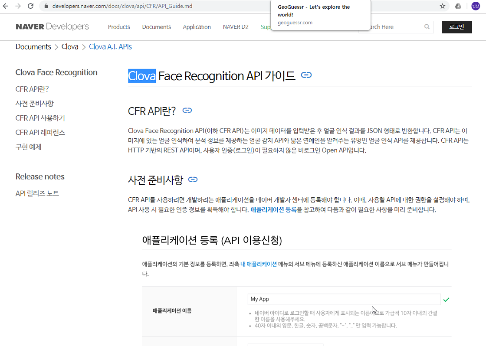

## 19.12.18 수업내용

협업 관련 추천 사이트 

github.com/jaeYeopHan/Interview_question_for_Beginner

github.com/jojoldu/junior-recruit-schduler

ujc.github.io

#### github flow

git 요약

clone : 원격 저장소 (github)을 내 컴퓨터에 복사해 온다

add: 내 컴퓨터에서 작업한 파일들을 스테이지에 추가

commit: 스테이지에 올라온 파일들을 가지고 내 컴퓨터에 저장(세이브와 같음)

push: 커밋들을 원격 저장소에 업로드

코드 뭉처 버리기 :마지막 커밋으로 되돌아가고 싶을때 사용

브랜치 : 기존 내용을 유지한 채 새로운 내용을 추가하고 싶을때 사용한다.

체크아웃 : 특정 브랜치(혹은 커밋)으로 돌아가고 싶을 때 사용.

소스트리의 체크아웃: 브렌치 이름을 더블클릭하는 것만으로 체크 아웃 가능.

#### 오픈소스 장점

#### 포트폴리오 장단점

#### wed 서비스 구조 이해

#### 부트 스트랩 -> 버튼 제공 사이트

https://getbootstrap.com/docs/4.4/examples/album/

#### 부트 스트랩 포트 폴리오

https://startbootstrap.com/themes/portfolio-resume/

#### 크롬에 도움되는 사이트

adguard -  유튜브 광고 제거

크롬 마켓 - 크롬의 다양한 툴

 

