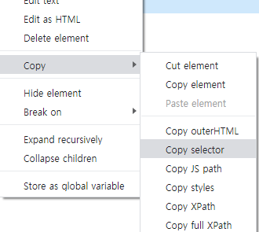
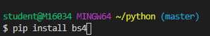
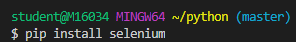

### 191219 python 

#### 저장,반복,분기

크리스마스 트리를 만든다.
1.나무,전구,장식을 준비한다.(저장)
2.나무가 충분히 예쁠때까지 나무를 장식한다.
   나무가 예쁜가?-분기
   예쁠때까지 장식을 반복한다.-반복
   나무를 장식한다는 것을 나무 = 나무 + 장식 -저장
3.나무가 충분히 예쁘면 그 나무는 크리스마스 트리가 된다.
  나무가 예쁘면 분기(조건)
  크리스마스트리=나무-(저장)

```
tree = '나무'
# len(tree) => 2
bulb = '전구'
deco = '장식'

while len(tree) < 20:
   tree = tree + bulb +deco 
   # 1st '나무전구장식'
   # 2nd '나무전구장식전구장식'
christmas_tree = tree
print(christmas_tree)
```

### Python 실습하기







여러번 사용하는 단어 설치 명령어




1.크리스 마스 장식

tree = '나무'

deco = '장식'


while len(tree) < 30:

  tree = tree +deco


christmas_tree = tree

print(christmas_tree)

2.

\# polite - 예의바른

\# print() 함수를 통해

\# 인사를 열번하는 코드를 작성해주세요


hi = '안녕하세요!'


for i in range(0,10):

  \#0 ~ 9 까지의 반복을 실행합니다.

  print(hi)

3. 명단에서 이름을 뽑아서 영어소개와 한글소개

import random


name = ['홍길동','희동이','둘리']

eng_name = {

  '홍길동':'hong',

  '희동이':'dong',

  '둘리': 'twolee'


}


지목된사람 = random.choice(name)

지목된영어이름 = eng_name[지목된사람]


\#저는 홍길동입니다. My name is hong 문자열을 만들고싶다

intro ='저는'+지목된사람+'입니다.'+'My name is'+지목된영어이름

intro2 = '저는{}입니다. my name is {}'.format(지목된사람,지목된영어이름)

intro3 = f'저는{지목된사람}입니다.My name is {지목된영어이름}'

print(intro)

print(intro2)

print(intro3)

4.웹에 자동 키워드 완성 후 검색 예제

from selenium import webdriver

from selenium.webdriver.common.keys import Keys


path='./chromedriver.exe'

driver = webdriver.Chrome(path)

driver.get('https://www.google.com/')

search_input = driver.find_element_by_css_selector('#tsf > div:nth-child(2) > div.A8SBwf > div.RNNXgb > div > div.a4bIc > input')

search_input.send_keys('hello world')

search_input.send_keys(Keys.RETURN)

5.웹페이지에서  환율 알아보기 프로그램 만들기

import bs4

import requests


html = requests.get('https://finance.naver.com/marketindex')

soup = bs4.BeautifulSoup(html.text,'html.parser')


doller = soup.select_one('#exchangeList > li.on > a.head.usd > div > span.value')


print (doller.text)